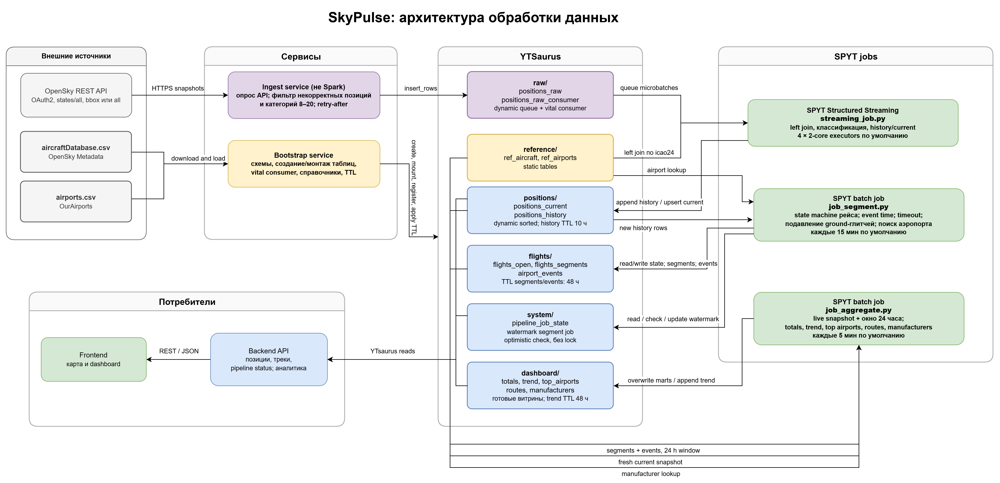

# SkyPulse

Полнофункциональное веб-приложение для отслеживания позиций самолётов в реальном времени с аналитикой. Живая карта мира, обогащённые данные из справочников, исторические тренды и дашборд статистики.

**Стек:** Python (OpenSky ingest + SPYT streaming/batch jobs) + Java/Spring Boot (web API) + React/TypeScript (фронтенд) + YTsaurus (OLAP + очереди + хранилище) + Docker Compose (деплой).

## Возможности
- **Живая карта** — самолёты движутся в реальном времени
- **Обогащение данных** — каждый борт дополнен информацией из справочников (тип, авиакомпания, регистрация)
- **История и треки** — полная история позиций борта и построение траектории полёта
- **Дашборд аналитики** — топ аэропортов, авиакомпаний, трафик-тренды, статистика вылетов-прилётов
- **Open-source и масштабируемо** — легко склонировать и запустить на собственном кластере YTsaurus

## Архитектура



**Компоненты:**

1. **Pipeline (Python/SPYT)**
   - `bootstrap_service` — разовая загрузка справочников на YT
   - `ingest_service` — поток OpenSky → очередь `positions_raw`
   - `streaming_job` — обогащение потока, live позиции (positions_current, positions_history)
   - `job_segment` — выделение рейсов, вылеты/прилёты аэропортов
   - `job_aggregate` — витрины для дашборда (dashboard_*, top/trends)

2. **Web API (Java/Spring Boot)**
   - `positions-service` — карта/позиции/треки борта
   - `analytics-service` — дашборд/статистика трафика

3. **Frontend (React + Vite)**
   - Карта с live-позициями
   - Дашборд аналитики (тренды, топ, статистика)

4. **Инфраструктура**
   - **YTsaurus** — единая платформа (очереди, таблицы)
   - **Docker Compose** — локальный и продакшен-деплой
   - **Nginx** — единая точка входа (80/443)


## Быстрый старт

### Требования

- **Python 3.11+** (pipeline)
- **Java 21+** (backend)
- **Node.js 18+** (frontend)
- **Docker & Docker Compose** (для упаковки и деплоя)
- Доступ к YTsaurus кластеру и токен
- OpenSky API учётная запись
  
### Локальный запуск всех компонентов

#### 1. Pipeline

```bash
cd pipeline
python -m venv .venv && source .venv/bin/activate  # Windows: .venv\Scripts\activate
pip install -e ".[dev]"
cp .env.example .env
# Заполните .env: YT_TOKEN, YT_BASE_PATH, OPENSKY_CLIENT_ID/SECRET

# Разово: создание таблиц и справочников на YT
python -m bootstrap_service.main

# Запустите в отдельных терминалах:
python -m ingest_service.main             # поток OpenSky
# В отдельном окружении SPYT:
python -m spyt.launch.run_streaming.py    # streaming_job (обогащение)
python -m spyt.launch.run_segment.py      # job_segment (рейсы)
python -m spyt.launch.run_aggregate.py    # job_aggregate (витрины)
```

#### 2. Positions Service (web API — позиции)

```bash
cd backend/positions-service
cp .env.example .env
# Заполните .env: PORT=8080, YT_PROXY, YT_TOKEN, пути к таблицам

docker compose up --build    # или ./gradlew bootRun
# Откройте http://localhost:8080/swagger-ui.html
```

#### 3. Analytics Service (web API — дашборд)

```bash
cd backend/analytics-service
cp .env.example .env
# Заполните .env: PORT=8081, YT_PROXY, YT_TOKEN, пути к таблицам

docker compose up --build    # или ./gradlew bootRun
# Откройте http://localhost:8081/swagger-ui.html
```

#### 4. Frontend

```bash
cd frontend
npm install
npm run dev    # запуск dev-сервера на http://localhost:5173
# или
npm run build  # production-сборка
```

### Проверка

```bash
curl http://localhost:8080/api/flights/live
curl http://localhost:8081/api/stats/dashboard
curl http://localhost:5173/
```


## Структура проекта

```
.
├── pipeline/              # Python: ingest, bootstrap, SPYT-джобы
│   ├── bootstrap_service/    # загрузка справочников и создание таблиц
│   ├── ingest_service/       # поток OpenSky → очередь
│   ├── spyt/                 # SPYT-джобы (streaming, segment, aggregate)
│   ├── common/               #config.py, yt_client.py
│   └── README.md
├── backend/
│   ├── positions-service/   # Java: web API для карты
│   │   ├── src/
│   │   ├── openapi.yaml     # контракт этого сервиса
│   │   ├── README.md
│   │   └── build.gradle.kts
│   ├── analytics-service/   # Java: web API для дашборда
│   │   ├── src/
│   │   ├── openapi.yaml     # контракт этого сервиса
│   │   ├── README.md
│   │   └── build.gradle.kts
├── frontend/                # React + TypeScript + Vite
│   ├── src/
│   ├── index.html
│   ├── package.json
│   ├── vite.config.ts
│   └── README.md
├── deploy/                  # Docker Compose + Nginx + деплой
│   ├── compose.prod.yml
│   ├── nginx/
│   ├── static/index.html
│   ├── .env.example
│   └── README.md
├── docs/
│   ├── database.md          # Схема таблиц YT
│   ├── jobs.md              # Контракт джоб и фильтрации
│   ├── openapi.yaml         # Полный API-контракт
│   └── SRS.md               # Требования проекта
├── RUN.md                   #  Как запустить
└── README.md               
```

## API

### Positions Service (карта)

```bash

# Последняя позиция борта
GET /api/flights/{icao24}

# История позиций / трек борта
GET /api/flights/{icao24}/track?sinceSeconds=3600

# Справочник аэропортов (поиск, пaginatio)
GET /api/airports?search=JFK&country=US&limit=50

# Статус пайплайна (едят ли данные)
GET /api/pipeline-status

# Health check
GET /actuator/health
```

### Analytics Service (дашборд)

```bash
# Последний снапшот агрегатов
GET /api/stats/dashboard

# Статистика по аэропортам (вылеты/прилеты за сутки)
GET /api/stats/airports

# Часовой профиль трафика
GET /api/stats/hourly-traffic?icao=KJFK

# Борта со squawk 7500/7700
GET /api/stats/emergencies

# Деталь по одному аэропорту
GET /api/airports/{icao}/stats

# Лог рейсов аэропорта
GET /api/airports/{icao}/flights?direction=departures
```


## Конфигурация

### Переменные окружения

Все переменные собраны в [RUN.md](RUN.md). Шаблоны:
- `pipeline/.env.example`
- `backend/positions-service/.env.example`
- `backend/analytics-service/.env.example`
- `frontend/.env.example`
- `deploy/.env.example`

### YTsaurus
Таблицы создаются с подпапками:
```
YT_BASE_PATH/
├── raw/          → positions_raw, positions_raw_consumer
├── reference/    → ref_aircraft, ref_airports
├── positions/    → positions_current, positions_history
├── flights/      → flights_open, flights_segments, airport_events
├── dashboard/    → dashboard_totals, dashboard_trend, ...
└── system/       → pipeline_job_state
```

### OpenSky API

Получите ключи на https://opensky-network.org/


## Разработка и тестирование

### Линтирование и форматирование

```bash
# Python
cd pipeline
ruff check --fix .
ruff format .
mypy .

# Java
cd backend/positions-service
./gradlew build   # компиляция + Checkstyle + тесты

# Frontend
cd frontend
npm run lint
npm run lint:fix
npm run typecheck
```

### Тестирование

```bash
# Python
cd pipeline
pytest tests/

# Java
cd backend/positions-service
./gradlew test

# Frontend
cd frontend
npm run test
```

## Деплой

### Локальный Docker Compose

```bash
cd deploy
cp .env.example .env
nano .env  # заполнить переменные

docker compose -f compose.prod.yml up -d --build
curl http://localhost/api/flights/live
```

### Продакшн (Ubuntu VM)

Подробно в [deploy/README.md](deploy/README.md):

1. **SSH на VM, установить Docker**
2. **Склонировать репо, заполнить `.env`**
3. **Запустить `docker compose -f compose.prod.yml up -d`**
4. **Настроить HTTPS**
5. **Наладить CI/CD фронтенда**


## Правила разработки

1. **Источники истины:**
   - [docs/database.md](docs/database.md) — схема таблиц
   - [docs/jobs.md](docs/jobs.md) — контракт джоб
   - [RUN.md](RUN.md) — пути таблиц и переменные

2. **Перед коммитом:**
   - Пройти линтеры (`ruff`, `mypy`, `Checkstyle`, `eslint`)
   - Пройти тесты
   - Обновить документацию и контракты если нужно

---
- **Документация:** [docs/](docs/), README в каждом модуле
- **Примеры:** примеры запросов в [Swagger UI](http://localhost:8080/swagger-ui.html) на dev-машине
---

## Ресурсы

- OpenSky Network — позиции самолётов и история полётов.
  Документация API: <https://openskynetwork.github.io/opensky-api/rest.html>
  Рабочий пример без авторизации (самолёты над Альпами):
  <https://opensky-network.org/api/states/all?lamin=45.8&lomin=5.9&lamax=47.8&lomax=10.5>
  Датасеты и справочники: <https://opensky-network.org/data>
- OurAirports — справочник аэропортов с координатами (public domain).
  Страница данных: <https://ourairports.com/data/>
  Файл: <https://davidmegginson.github.io/ourairports-data/airports.csv>

YTsaurus: <https://ytsaurus.tech/docs>
Yandex Maps API: <https://yandex.ru/maps-api>

